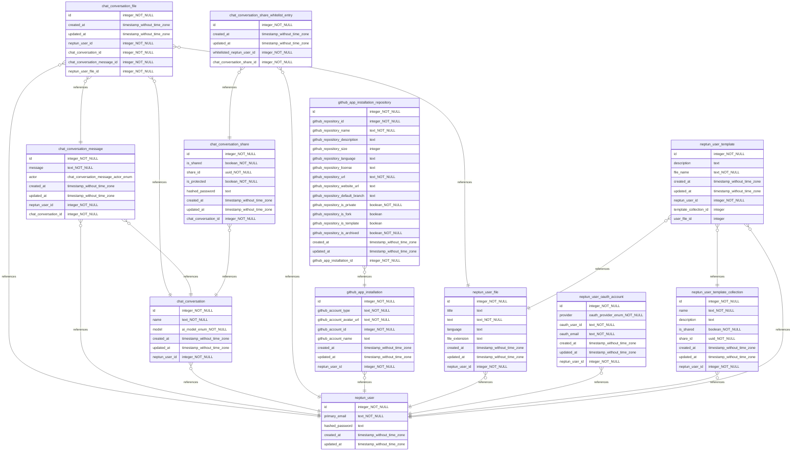

# Neptun Website

> [!NOTE]
> The website of the neptun-tool.

View status [here](https://pfn4gnjb.status.cron-job.org).

## Info

> Built with [Nuxt 3](https://nuxt.com/docs/getting-started/introduction), [Nitro](https://nitro.unjs.io), [Vite](https://vitejs.dev) and [Vue 3](https://vuejs.org).

## Setup

Install `ni` globally:

```bash
npm i -g @antfu/ni
```

Install packages:

```bash
ni # same as npm i, pnpm i, yarn i, bun i
```

Install new packages:

```bash
ni [package_name] # same as npm i [package_name], pnpm i [package_name], yarn i [package_name], bun i [package_name]
```

## Development

Run the development server:

```bash
nr dev
```

Finding the version of a sub-dependency:

```bash
nr find-version [package_name]
```

<details>
<summary>All scripts</summary>

```js
"scripts": {
  "dev": "set EDITOR=code && nuxt dev",
  "devx": "set EDITOR=code && nuxt dev --host --https --ssl-cert ./configurations/development/ssl/server.crt --ssl-key ./configurations/development/ssl/server.key",
  "app": "export EDITOR=code && nuxt dev",
  "appx": "export EDITOR=code && nuxt dev --host --https --ssl-cert ./configurations/development/ssl/server.crt --ssl-key ./configurations/development/ssl/server.key",
  "preparex": "npm run types && npm run render",
  "types": "npx nuxi prepare",
  "render": "nuxt generate",
  "postinstall": "nuxt prepare",
  "build": "nuxt build",
  "preview": "nuxt preview",
  "format-and-lint": "npx prettier --plugin-search-dir . --check . && npx eslint .",
  "format": "npx prettier --write . --single-quote --trailing-comma es5 --semi",
  "lint": "eslint . --fix",
  "lint-settings": "npx @eslint/config-inspector",
  "check": "npx nuxi typecheck",
  "shadcn": "npx shadcn-vue@latest add",
  "cleanup": "pnpx nuxi cleanup .",
  "fresh": "npm cache verify && pnpm rebuild && pnpx nuxi cleanup",
  "upgrade": "npx nuxi upgrade -f",
  "statistics": "npx nuxi analyze",
  "info": "npx nuxi info",
  "find-version": "node ./helpers/find-package-version.cjs",
  "db:push": "drizzle-kit push --config drizzle-dev.config.ts",
  "db:push:prod": "drizzle-kit push --config drizzle-prod.config.ts",
  "db:pull": "drizzle-kit introspect --config drizzle-dev.config.ts",
  "db:pull:prod": "drizzle-kit introspect --config drizzle-prod.config.ts",
  "db:generate": "drizzle-kit generate --config=drizzle-dev.config.ts",
  "db:generate:prod": "drizzle-kit generate --config=drizzle-prod.config.ts",
  "db:migrate": "bun run ./helpers/migrate.ts environment=dev",
  "db:migrate:prod": "bun run ./helpers/migrate.ts environment=prod",
  "db:studio": "drizzle-kit studio --config drizzle-dev.config.ts --host 127.0.0.1",
  "db:studio:prod": "drizzle-kit studio --config drizzle-prod.config.ts --host 127.0.0.1",
  "db:dump-data": "bun run ./helpers/backup.ts",
  "db:dump-schema": "bun run ./helpers/backup.ts --schema-only",
  "db:mermaid": "bun run ./helpers/schema-to-mermaid.ts",
  "db:png": "bun run ./helpers/mermaid-to-png.ts",
  "db:diagram": "powershell \"Start-Process cmd -Verb RunAs -ArgumentList '/k cd /d \\\"%CD%\\\" && helpers\\generate-diagram-native.bat'\""
},
```

</details>

### Network-wide access

> SSL for network-wide access. This is useful, if you want to test it on mobile, while still developing on your local machine.

```bash
nr devx
```

<details>
<summary>How the keys were generated</summary>

```bash
openssl genrsa 2048 > server.key
chmod 400 server.key
openssl req -new -x509 -nodes -sha256 -days 365 -key server.key -out server.crt
```

```bash
You are about to be asked to enter information that will be incorporated
into your certificate request.
What you are about to enter is what is called a Distinguished Name or a DN.
There are quite a few fields but you can leave some blank
For some fields there will be a default value,
If you enter '.', the field will be left blank.
-----
Country Name (2 letter code) [AU]:AT
State or Province Name (full name) [Some-State]:Wien
Locality Name (eg, city) []:Wien
Organization Name (eg, company) [Internet Widgits Pty Ltd]:Neptun AI
Organizational Unit Name (eg, section) []:Development
Common Name (e.g. server FQDN or YOUR name) []:localhost
Email Address []:neptunai.contact@gmail.com
```

</details>

### Known Issues

- Doesn't work in `bun@1.1.30`.
- Slow on `Windows11` (faster in WSL2 (might be better in `nuxt@v4`, which is currently in nightly-channel))
  - If you are coding in a folder, that is in your NAS/Cloud (hopefully with a file- and folder [blacklist](https://gist.github.com/jonasfroeller/0e42c350947c7d04b0dc8a9735f2412e)), disable syncing while developing, so that it doesn't cause performance issues, because Windows loves to lock files.
  - `srcDir` (`nuxt@v4` feature, that can be used in `nuxt@v3` already) causes some imports and types to break... (could improve performance on Windows theoretically tho).
- SSL needed for mobile, if `--https` is set. (else `ERR_SSL_PROTOCOL_ERROR`). Use `devx` for that.
- Oauth doesn't work using https in development mode. (causes `ERR_EMPTY_RESPONSE`). Just use E-Mail and Password login for now.

### Docker

```bash
docker build -t neptun -f ./configurations/development/Dockerfile.dev .
```

```bash
docker run --rm -it -p 42124:42124 --env-file .env --name neptun neptun
```

or

```bash
docker compose -f ./configurations/production/docker-compose.yml -f ./configurations/development/docker-compose.yml up --build
```

### Database

> The database, currently Postgres, is managed with [Drizzle](https://orm.drizzle.team) and can be replaced with any other database, that Drizzle supports.

**Tables**: `lib\types\database.tables\schema.ts`
**Relations**: `lib\types\database.tables\relations.ts`

<details>
<summary>Postgres specific commands, i needed (and didn't know) nonetheless</summary>

Get all enum values:

```bash
SELECT typname, enumlabel
FROM pg_enum e
JOIN pg_type t ON e.enumtypid = t.oid;
```

Get specific enum values:

```sql
SELECT unnest(enum_range(NULL::<enum_name>));
```

Update enum values (if the migration get's messed up somehow):

```sql
ALTER TYPE <enum_name> RENAME TO <enum_name>_old;
CREATE TYPE <enum_name> AS ENUM (
    'Value1',
    'Value2',
);
ALTER TABLE <table_name>
  ALTER COLUMN <column_name> TYPE <enum_name>
  USING (
    CASE <column_name>::text
      WHEN 'removedValue' THEN 'existingValue'
      ELSE <column_name>::text
    END::<enum_name>
  );
DROP TYPE <enum_name>_old;
```

</details>

#### Overview

> These commands help manage the database schema and migrations using Drizzle ORM.

#### Commands in Order of Common Usage

```bash
# 1. Pull existing schema from database (if you have an existing database)
nr db:pull        # Pulls current database schema into TypeScript files

# 2. Generate SQL migrations from schema changes
nr db:generate    # Creates SQL migration files based on schema changes

# 3. Apply migrations to database
bun run db:migrate     # Executes pending SQL migrations on the database (executes a .ts file, NodeJs theoretically supports execution in the newest version too, you could also use a global package)

# 4. (Alternative to 2+3) Push schema changes directly
nr db:push        # Directly applies schema changes without migration files
                       # ⚠️ Use only in development! Not recommended for production

# Development Tools
nr db:studio      # Opens Drizzle Studio for visual database management
```

#### When to Use Which Command

- **db:pull**

  - When starting work with an existing database
  - To sync your TypeScript schema with database changes made outside your codebase
  - For database-first development approach

- **db:generate**

  - After making changes to your schema TypeScript files
  - When you need SQL migration files for version control
  - Before deploying to production
  - For team collaboration

- **db:migrate**

  - After generating migration files
  - When deploying to production
  - To apply pending migrations in a controlled manner
  - For tracking migration history

- **db:push**

  - During local development for quick iterations
  - For prototyping
  - ⚠️ Never use in production - it can lead to data loss
  - When migration history is not important

- **db:studio**
  - For visual database inspection
  - To manage data during development
  - For debugging database state

#### Schema



##### Exporting

```bash
bun run db:dump-schema
```

##### ERD

[drawio.com](https://www.drawio.com/blog/diagrams-from-code) allows you to import sql, but you have to connect the tables yourself, which is too much work imo.
That is why I wrote 3 scripts. One for generating a database schema sql-dump, one to generate a mermaid ERD from that SQL and one to generate a mermaid png-diagram from that ERD.

###### Windows

> Generating 6 files at once. 3 with timestamp, 3 being the latest version for the documentation.

> [!IMPORTANT]
> This does not work with bun. It only works with npm, pnpm or yarn.  
> The script installs all required tools and dependencies (NOT `npm`, run `ni` before executing it).

```bash
npm run db:diagram # There is also `generate-diagram-wsl.bat`, but I did parts of it blindly and didn't test it properly, because my virtualization is broken right now. (CPU overheated and now some features do not work anymore... A new one is on the way anyway.)
```

###### Linux

```bash
# postgresql needed for pg_dump
sudo apt-get update
sudo apt-get install -y wget ca-certificates
wget --quiet -O - https://www.postgresql.org/media/keys/ACCC4CF8.asc | sudo apt-key add -
sudo sh -c 'echo "deb http://apt.postgresql.org/pub/repos/apt/ $(lsb_release -cs)-pgdg main" > /etc/apt/sources.list.d/pgdg.list'
sudo apt-get install -y postgresql-client-16

# needed for mermaid-to-png (doesn't work on wsl2, because puppeteer doesn't work there)
# puppeteer should be in `node_modules` already, but if it is not, you can install it with this command: `npm install -g puppeteer`
npx puppeteer browsers install chrome-headless-shell
```

```bash
bun run db:dump-schema
```

```bash
bun run db:mermaid
```

```bash
bun run db:png
```

## Production

### NodeJS Server

```bash
nr build
```

Locally preview production build:

```bash
nr preview
```

### Dockerize NodeJS Server

```bash
docker build -t neptun -f ./configurations/production/Dockerfile.prod .
```

```bash
docker run --rm -it -p 42124:42124 --env-file .env --name neptun neptun
```

or

```bash
docker compose up --build
```
