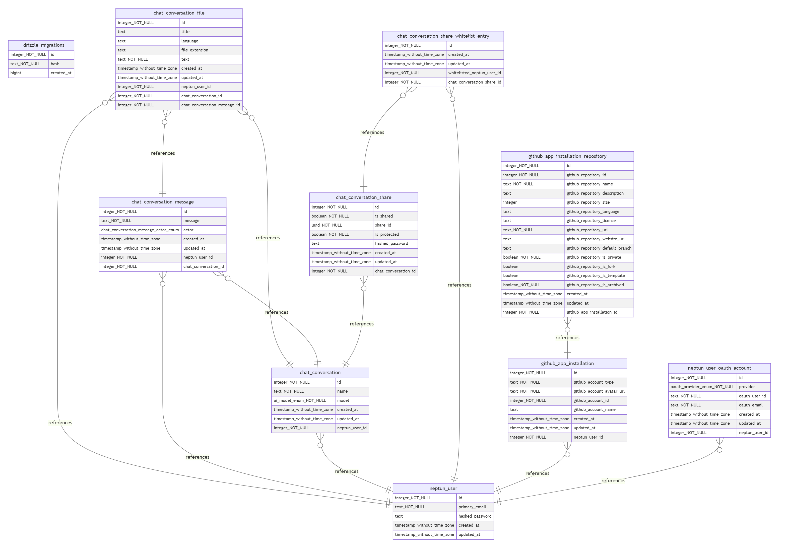

# Neptun Website

The website of the neptun-tool. View status [here](https://pfn4gnjb.status.cron-job.org).

## Info

Built with [Nuxt 3](https://nuxt.com/docs/getting-started/introduction), [Nitro](https://nitro.unjs.io), [Vite](https://vitejs.dev) and [Vue 3](https://vuejs.org).

## Setup

```bash
pnpm install
```

## Development

```bash
pnpm run dev
```

### Development Server

How the keys were generated:

```bash
openssl genrsa 2048 > server.key
chmod 400 server.key
openssl req -new -x509 -nodes -sha256 -days 365 -key server.key -out server.crt
```

```bash
You are about to be asked to enter information that will be incorporated
into your certificate request.
What you are about to enter is what is called a Distinguished Name or a DN.
There are quite a few fields but you can leave some blank
For some fields there will be a default value,
If you enter '.', the field will be left blank.
-----
Country Name (2 letter code) [AU]:AT
State or Province Name (full name) [Some-State]:Wien
Locality Name (eg, city) []:Wien
Organization Name (eg, company) [Internet Widgits Pty Ltd]:Neptun AI
Organizational Unit Name (eg, section) []:Development
Common Name (e.g. server FQDN or YOUR name) []:localhost
Email Address []:neptunai.contact@gmail.com
```

### Known Issues

- Doesn't work in `bun@1.1.30`.
- Extremely slow on `Windows11` (faster in WSL (might be better in nuxt@v4, which is currently in nightly-channel)).
- `srcDir` causes some imports and types to break... (could improve performance on windows theoretically tho).
- SSL needed for mobile, if `--https` is set. (else `ERR_SSL_PROTOCOL_ERROR`).
- Oauth doesn't work using https in development mode. (causes `ERR_EMPTY_RESPONSE`).

### Docker

```bash
docker build -t neptun -f ./configurations/development/Dockerfile.dev .
```

```bash
docker run --rm -it -p 42124:42124 --env-file .env --name neptun neptun
```

or

```bash
docker compose -f ./configurations/production/docker-compose.yml -f ./configurations/development/docker-compose.yml up --build
```

### Schema

#### Exporting

```bash
bun run db:dump-schema
```

#### ERD

[drawio.com](https://www.drawio.com/blog/diagrams-from-code) allows you to import sql, but you have to connect the tables yourself, which is too much work imo.
That is why I wrote 3 scripts. One for generating a database schema sql-dump, one to generate a mermaid ERD from that SQL and one to generate a mermaid png-diagram from that ERD.

```bash
sudo apt-get update
sudo apt-get install -y postgresql-client-16
```

```bash
bun run db:dump-schema
```

```bash
bun run db:mermaid
```

```bash
bun run db:png
```



## Production

```bash
pnpm run build
```

Locally preview production build:

```bash
pnpm run preview
```

### Docker

```bash
docker build -t neptun -f ./configurations/production/Dockerfile.prod .
```

```bash
docker run --rm -it -p 42124:42124 --env-file .env --name neptun neptun
```

or

```bash
docker compose up --build
```
